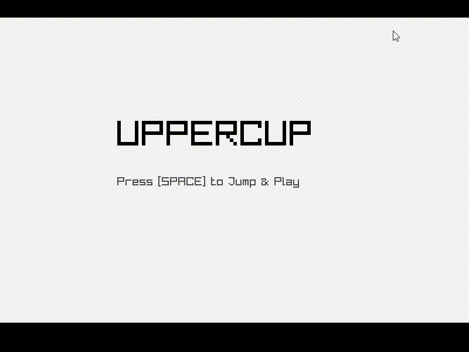

# Tugas Akhir Mata Kuliah Design Pattern
## Oscar Javier Abdullah	(5223600001)</br>Hatfan Sahrul Ramadhan	(5223600004)
Proyek ini merupakan implementasi tugas akhir untuk mata kuliah **Design Pattern**. Game dikembangkan menggunakan bahasa C++ dengan bantuan library **raylib** untuk keperluan grafis, serta menerapkan <i>Design Patterns</i> seperti:

- Singleton
- Factory
- State

## 📦 Struktur Proyek
```bash
project-root/
│
├── game/
│ └── src/ 
│ └── include/ 
│
├── image/ # Gambar/asset (pesawat.png, dll)
│
├── build/ # Folder hasil build (berisi game.exe)
│
├── CMakeLists.txt # Konfigurasi build (CMake)
│
└── README.md # Dokumentasi
```

## ▶️ Cara Menjalankan

**Build proyek dengan CMake**
```bash
   mkdir build
   cd build
   cmake ..
   mingw32-make
   game.exe
```
## 🎮 Gameplay


## Diagram UML
<!--  -->

